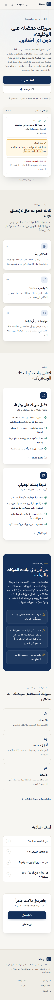
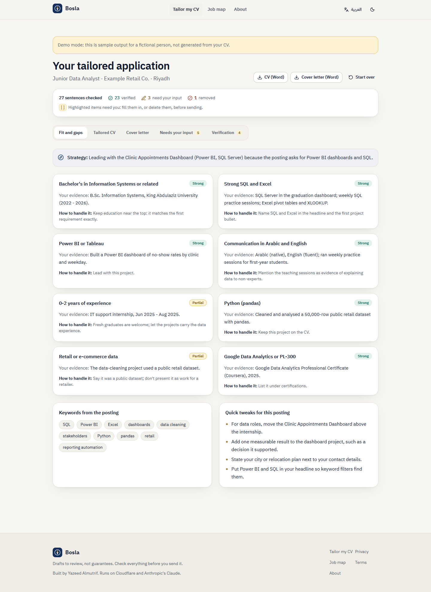
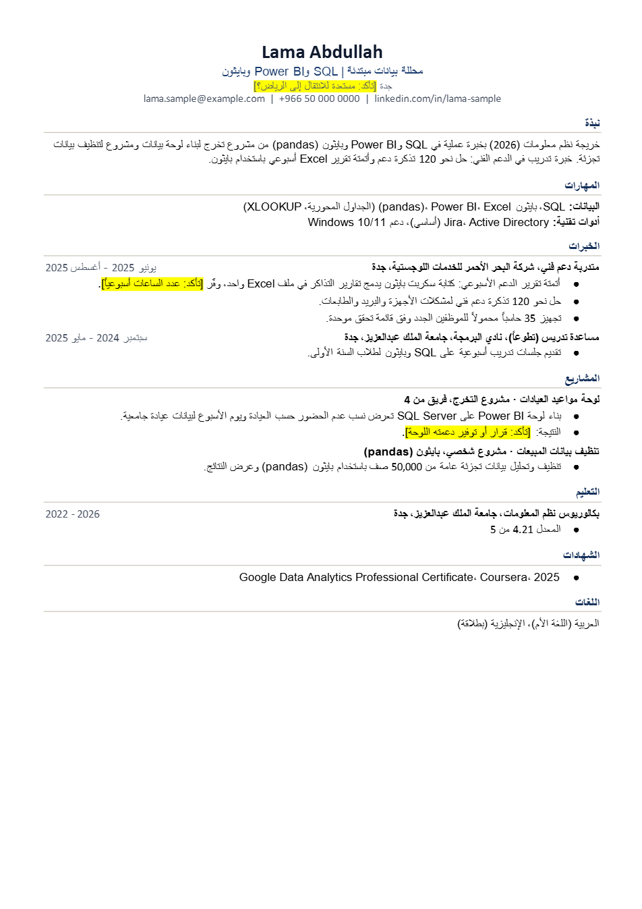

# Bosla (بوصلة) - working name

A free, bilingual (Arabic / English) web app for job seekers in Saudi Arabia:

- **Tailor your CV to a job.** Upload a CV (PDF / DOCX, or paste it) and paste a job posting. You get a fit-and-gap table, a tailored one-page CV and a cover letter of at most 350 words (Word downloads, or print to PDF), plus a list of everything you must confirm before sending.
- **Job-search map (خارطة وظائف).** Upload a CV and get 8 job titles to search, employers in Riyadh and Jeddah that fit you (reason, estimated salary, careers link), a salary reference table, platforms to check weekly, relevant programmes, and 6 CV fixes ranked by impact.

Built by Yazeed Almutrif. Status: runs locally and is tested end to end in mock mode. **Not deployed.**

The product name lives in one constant: `shared/brand.ts`.

> **بالعربية:** «بوصلة» (اسم مبدئي) تطبيق ويب مجاني بالعربية والإنجليزية للباحثين عن عمل في السعودية: (1) تكييف السيرة الذاتية مع إعلان وظيفة، مع جدول المطابقة والفجوات وسيرة من صفحة واحدة وخطاب تقديم، و(2) خارطة وظائف شخصية: مسميات للبحث، وجهات في الرياض وجدة، وجدول رواتب تقديري، ومنصات، وبرامج، وتحسينات للسيرة. لا يخترع أي معلومة: كل جملة عن الشخص مربوطة بسيرته، وكل ما ينقص يظهر كخانة «أكمل». **الحالة:** يعمل محليًا ومختبر بالكامل في وضع العرض (Mock)، **غير منشور** على الإنترنت. بيانات العرض لشخص افتراضي.

| Landing (AR, mobile) | Tailored application (EN) | Tailored CV exported to Word (AR) |
|---|---|---|
|  |  |  |

All screenshots are from mock mode and show a **fictional** sample person ("Lama Abdullah"). More in [`screenshots/`](screenshots).

## The accuracy promise: nothing invented

Every run goes through the same pipeline (`worker/pipeline.ts`):

1. **Extract** the CV into a fact sheet (atomic facts with ids F1, F2...). A deterministic self-check (`checkFactSheet`) drops any fact whose numbers or employer don't appear in the CV text.
2. **Generate** only from the fact sheet. Every sentence about the person must cite fact ids. Missing details become visible `[[confirm: ...]]` placeholders. The job map may only pick company / programme / salary / platform **ids** from the curated dataset (enforced by the JSON schema's enums); names, salaries, links and dates are attached by code, never written by the model.
3. **Verify.** An LLM judge checks every claim against the fact sheet, then a deterministic verifier (`shared/verify.ts`) always runs: numbers not in the CV become placeholders, employers / schools / certificates / skills not in the CV are removed, posting keywords the CV doesn't support are marked for confirmation, sentences that cite no fact are removed, the cover letter is kept under 350 words, and every placeholder lands in the "needs your input" list. If the judge call fails, the deterministic pass still runs and the UI says so.

Pasted postings and CVs are treated as untrusted data (prompt-injection instructions in the system prompts, structured outputs, dataset-only links, verifier keyword check, output rendered as plain text).

## Architecture

```
Browser (React 19 + Vite + Tailwind v4, AR RTL / EN LTR, light / dark)
  |  CV file is read IN THE BROWSER (pdf.js / mammoth); only text is sent
  |  Word files are built IN THE BROWSER (docx); PDF = print to PDF
  v
One Cloudflare Worker (same origin: serves dist/ + /api/*, no CORS)
  /api/config  public settings (Turnstile site key, runs per day, mock flag)
  /api/quota   runs left today
  /api/tailor  /api/map  -> Turnstile check -> daily limits + spend cap -> pipeline -> NDJSON progress stream
  |                     Durable Object "Limiter" (SQLite): per-browser + per-IP daily counters (salted hashes only),
  |                     daily spend ledger with in-flight reservations (kill switch), rows purged after about 2 days
  v
Claude API (@anthropic-ai/sdk, structured JSON outputs, adaptive thinking, fallbacks: "default")
```

Model: `CLAUDE_MODEL` in `wrangler.jsonc` (default `claude-sonnet-5` since 2026-09-30, chosen for cost; switch to `claude-opus-5` if real test runs show Sonnet isn't accurate enough). Changing it is one line; prices for the spend cap are in `shared/pricing.ts`.

## Run it locally

Requirements: Node 20+ (tested on Node 24.19.0), Windows / macOS / Linux.

```bash
npm install
npm run start:mock      # build + Worker in mock mode (no API key needed)
# open http://127.0.0.1:8787
```

Mock mode returns realistic fixture results for a **fictional** sample person (the UI shows a "demo mode" banner) and uses Cloudflare's official always-pass Turnstile test keys. Everything else (validation, Turnstile check, limits, streaming, verification, downloads) is the real code path.

With a real API key (costs money): copy `.dev.vars.example` to `.dev.vars` (git-ignored), fill `ANTHROPIC_API_KEY`, `HASH_SALT`, Turnstile keys, set `MOCK=false`, then `npm start`.

Front-end development with hot reload: `npm run dev` (Vite on :5173 proxies `/api` to the Worker on :8787).

## Tests and checks (all run locally, 2026-09-27; types, lint, unit, E2E and dataset audit re-run 2026-10-03 with the same results)

| Check | Command | Result |
|---|---|---|
| Types | `npm run typecheck` | 0 errors |
| Lint | `node scripts/lint-summary.mjs` | 0 problems |
| Unit tests (parsing, limiter, verifier, security) | `npm test` | 60 / 60 pass |
| E2E (both tools, AR + EN, 375 px + 1440 px, error states, uploads, real limiter) | `npm run test:e2e` | 19 / 19 pass |
| Lighthouse, landing, mobile (AR / EN) | `node scripts/lighthouse.mjs <url>` | performance 93 / 93, accessibility 100, best practices 100, SEO 100 |
| Lighthouse, landing, desktop (AR / EN) | same | 100 / 100 / 100 / 100 |
| Console / hydration errors (6 pages x 2 themes) | `node scripts/console-check.mjs` | 0 |
| Dataset audit (fields, ids, personal-data scan) | `npm run audit:data` | 0 problems |
| Dataset links (fetch + real Chrome) | `node scripts/check-links.mjs` | 60 links: 52 load, 8 behind bot challenges (marked in the UI), 0 dead |

Lighthouse ran against the local Worker (`wrangler dev`), not a deployed site; numbers on Cloudflare's network will differ. Screenshots: `screenshots/`.

## Data

`data/dataset.json`: 45 employers, 27 salary rows, 5 programmes, 10 platforms, 6 recurring CV fixes, compiled 2026-09-27 from the author's own job-market research (published job maps, Aug-Sep 2026) and the official HRDF Tamheer page. Every entry has a source id and an "as of" date; salaries are labelled estimates (the Tamheer stipend is the official figure). No personal information about the people the original maps were made for. `npm run audit:data` scans for that with generic patterns, plus any extra names you list in the git-ignored file `scripts/private-terms.local.json` (`[{ "re": "<regex>", "flags": "i" }]`).

Link recheck on 2026-09-27 removed two employers whose careers links no longer work and have no reachable official alternative (one portal domain has no DNS; the other has TLS and certificate errors), fixed Jadarat (`jadarat.sa`, the `www` host no longer resolves) and replaced SITE's dead LinkedIn page with its official careers page.

## Cost and limits (estimates until measured with a real key)

Prices per million tokens, Claude API, read 2026-09-27 from https://platform.claude.com/docs/en/about-claude/pricing:

| Model | Input | Output | Cache read | Cache write (5 min) |
|---|---|---|---|---|
| `claude-opus-5` | $5 | $25 | $0.50 | $6.25 |
| `claude-sonnet-5` (default) | $2 | $10 | $0.20 | $2.50 |

One run = 3 calls (extract, generate, verify). Estimated typical usage for a 1-3 page CV: about 11-18k input tokens and 9-14k output tokens in total (thinking is billed as output; Arabic text uses more tokens than English). ✍️ These token counts are estimates from the measured prompt and schema sizes, not from real API runs (no key was used); the Worker logs the real cost of every run (`costMicroUsd`), so check the first real runs.

| | Opus 5 | Sonnet 5 |
|---|---|---|
| Estimated cost per run (11-18k in x input price + 9-14k out x output price) | about $0.28-0.44 | about $0.11-0.18 |
| Worst case the spend cap reserves per run (max tokens on every call, 3,000-character CV and posting) | about $1.07 | about $0.43 |

Suggested limits (in `wrangler.jsonc`): 3 runs per browser per day, 10 per IP per day, daily budget `DAILY_BUDGET_USD` = 5. The budget is a hard ceiling: at $5/day the most that can be spent is $150 in a 30-day month.

Monthly scenario at 10 runs a day (300 runs): Opus about $84-132, Sonnet about $33-54. The $5 daily cap covers roughly 11-17 runs a day on Opus or 27-45 on Sonnet.

Cloudflare (read 2026-09-27, developers.cloudflare.com): Workers Free 100,000 requests/day and 10 ms CPU per request (time waiting on the Claude API doesn't count); static assets free and unlimited; Durable Objects on the Free plan (SQLite) 100,000 requests/day; Turnstile has no stated usage cap on the pages checked.

## Security and privacy notes

- API key and salts only in Worker secrets (`wrangler secret put`) or the git-ignored `.dev.vars`. Never in code, logs or the browser.
- No accounts, no CV storage. Logs contain only tool, success, error code, duration and cost.
- Same-origin API; cross-site POSTs rejected; strict request schemas; body read with a hard size cap; control characters stripped.
- Turnstile on every run (token single-use, hostname checked), per-browser and per-IP (IPv6 by /64) daily limits, and a global daily spend cap that reserves the worst-case cost before each run.
- CSP without inline scripts except the one hashed boot script; no `dangerouslySetInnerHTML`.
- Known limits: `/api/quota` and `/api/config` are unauthenticated (a flood could use up free-tier request quotas; add a Cloudflare rate-limiting rule before launch); people behind the same carrier NAT share the per-IP limit; the 10 ms CPU limit on the Free plan couldn't be measured locally.

## Before going live (needs Yazeed)

1. Choose the name (one line in `shared/brand.ts`).
2. Anthropic API key with a spending limit set in the Anthropic console.
3. Cloudflare account; create a Turnstile widget (site key + secret); set secrets; choose the model and daily budget.
4. Domain (optional; workers.dev works).
5. Approve the deploy (`npx wrangler deploy`).
